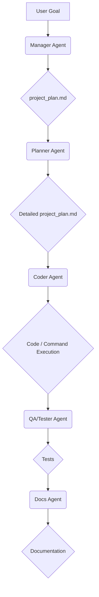

# HomeLLMCoder Architecture

This document provides a high-level overview of the HomeLLMCoder application's architecture. The design emphasizes modularity, extensibility, and a clear separation of concerns.

## Core Philosophy

The application is built around a **plan-driven agentic workflow**. Instead of a single monolithic AI, a team of specialized agents collaborates to achieve a user's goal. This process is orchestrated through a central `project_plan.md` file, which serves as the single source of truth for the project.

## The Agentic Workflow

The workflow begins with the user providing a high-level goal to the `Manager Agent`.

1.  **Manager Agent:** Acts as the project architect. It receives the user's goal and creates a `project_plan.md` file, which outlines the project and assigns high-level tasks to the other agents.
2.  **Planner Agent:** Reads the `project_plan.md` file and refines it into a detailed, step-by-step execution plan. The Planner's output is strictly an updated `project_plan.md`.
3.  **Specialist Agents (Coder, Refactor, QA/Tester, Docs):** Execute the detailed steps provided by the Planner. The `Coder Agent` can now execute terminal commands (e.g., `pip install`, `npm install`, `composer create-project`) directly from the plan. Each agent focuses on its specific area of expertise, ensuring high-quality output.

## Main Components

-   **`main.py`**: The application's entry point.
-   **`src/`**: The main source code directory.
    -   **`ui/`**: Contains all PyQt6 UI components, including `MainWindow`, `ChatWidget`, `PlanWidget`, and `TerminalWidget` (which handles `run_command` execution).
    -   **`llm_service/`**: Manages interaction with the local LLM. This is where the agents and their system prompts are defined.
    -   **`services/`**: Provides core application services, such as `FileOperationService` and `HistoryService`.

## Communication

Communication between the UI and the backend services is handled through a combination of direct method calls and Qt's signal and slot mechanism. This ensures a decoupled and maintainable codebase.
